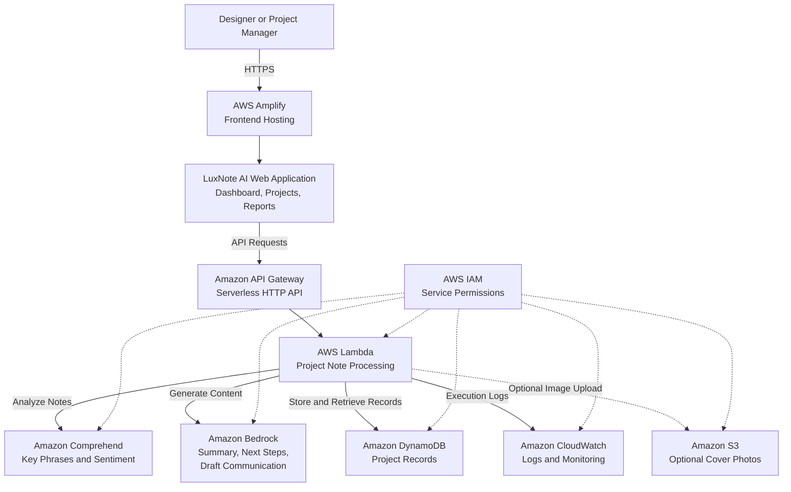

# LuxNote AI AWS Architecture

## Processing Flow

1. The user accesses the LuxNote AI frontend hosted by AWS Amplify.
2. The frontend sends HTTPS requests through Amazon API Gateway.
3. API Gateway invokes AWS Lambda.
4. Lambda uses Amazon Comprehend to identify key phrases and sentiment.
5. Lambda uses Amazon Bedrock to generate summaries, next steps, and draft communication.
6. Processed project records are stored in Amazon DynamoDB.
7. Amazon CloudWatch records execution logs and processing status.
8. AWS IAM controls service-to-service permissions.
9. Amazon S3 optionally stores project cover photos.
